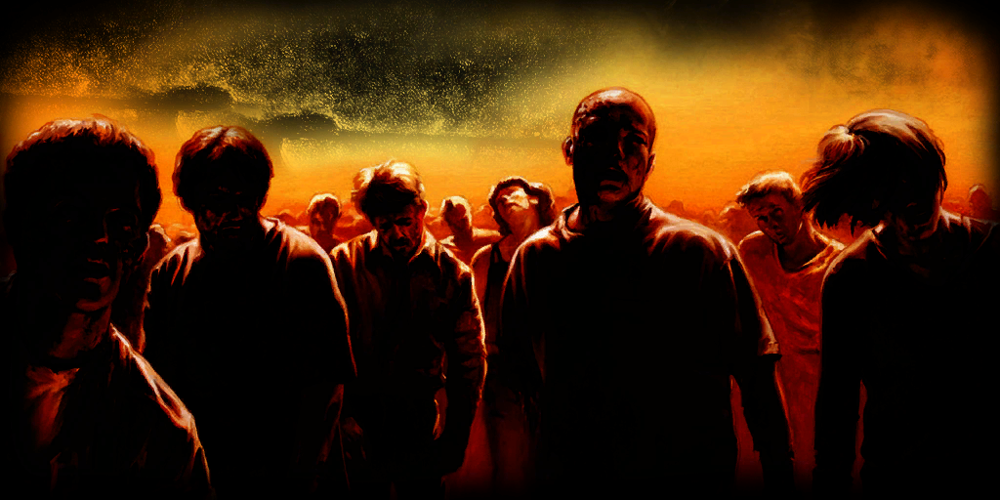

# Reign of the Undead

This project is the "Reign of the Undead" CoD4 Mod.  It is *not* compatible with [ROTU-Revolution](https://rotu-revolution.com/).  
I am importing it from the archived Google Code Subversion repo, which is really just a working copy on steroids, and augmenting it with my local original files.  Note that *all* of the version control information was lost when Google Code shut down.  I have the original repo up to rev 87, before I moved to Google Code, but I can't see how that would be helpful.

Do NOT fork/clone it yet, as things will change wildly as I port this to github, the best I can. I'm making breaking changes to the build system, but I have successfully gotten CoD4 installed and patched on Linux, and also got the entire RotU mod compiled on Linux. I'll update this message when it is safe to tinker.

## Description

RotU was originally written by Bipo (bipolarmonk) for the 1.x series.  Bipo then stopped development, open-sourced his code, and then I wrote the 2.2.x series.  ROTU-Revolution was independently created by others from Bipo's original code (I started working months earlier, but they made a public annoucement of their intention while I was still hacking in private).  So, they are two separate mods; any code or resources that work together is coincidence.

## Getting Started

### I Just Wanna Play

Players typically do not need to manually install the mod if the server supports auto-download—just join the server, and the mod files will download automatically.  However, if auto-download is disabled or not supported on that server, manual installation of the mod is necessary before joining.

In the event you have to manually-install, you will need to install the mod, and likely the maps the server uses as well.  You will also need to know the name of the mod (as used by the server), so you will need to contact the server operator. In general, for manual install:

 1. Create a folder for the mod in your CoD4 `[game_root]/Mods` folder
 2. Download RotU2.2.2 Release, unzip it in a temporary spot
 3. Copy all the files except `mp_surv_testmap` into that folder you made in step 1.  Only the *.ff & *.iwd files are critical (probably; untested), but no harm having the others.
 4. Copy `mp_surv_testmap` into your CoD4 `[game_root]/usermaps` folder.  If usermaps doesn't exist, create it.

### I Want to Host a LAN/Internet Server

See [Setting Up A Server](wiki/SettingUpAServer.md)

### I Want to Write Code

Buckle up, Buttercup.  You will need to install & configure a bunch of stuff to set up a development environment.

Start here:
 - [Installing CoD4 on Kubuntu 25.10](wiki/InstallingCoD4Kubuntu25.10.md)
 - [Setting Up a Development Environment](wiki/DevelopmentEnvironment.md)

### I Just Want a Copy of the Code

Cloning the repository will *not* get you working code, suitable for playing or hosting a server.  It will get you a copy of the source code *only*.

To get a copy of the project running locally:

1. Clone the repository:
```bash
git clone https://github.com/marktaff/reign-of-the-undead.git